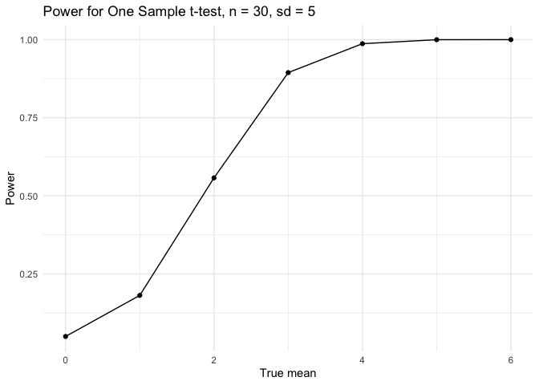
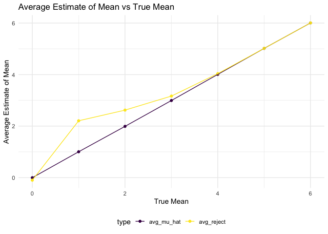
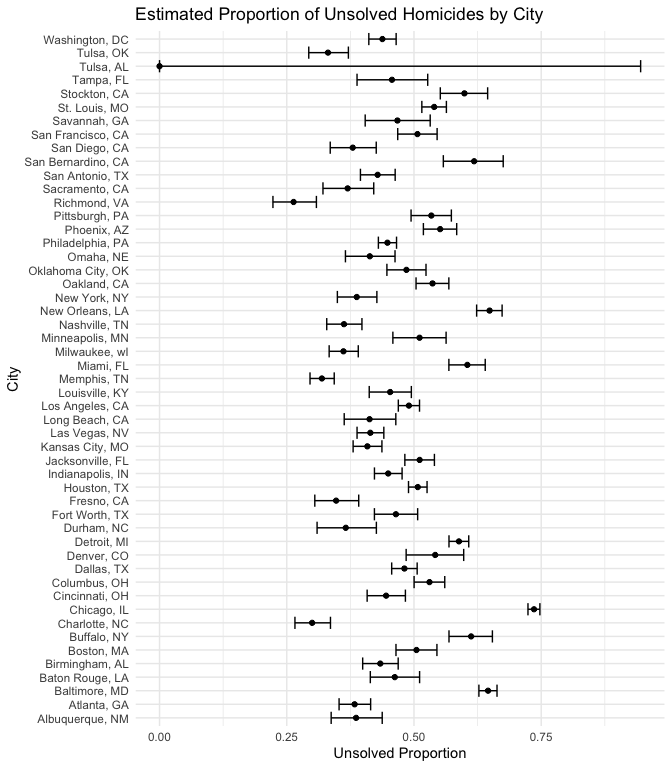

P8105 HW5
================
Veerapetch Petchger
2025-10-31

# Problem 1

**Suppose you put 𝑛 people in a room, and want to know the probability
that at least two people share a birthday. For simplicity, we’ll assume
there are no leap years (i.e. there are only 365 days) and that
birthdays are uniformly distributed over the year (which is actually not
the case).**

**Write a function that, for a fixed group size, randomly draws
“birthdays” for each person; checks whether there are duplicate
birthdays in the group; and returns TRUE or FALSE based on the result.**

``` r
shared_birthday = function(group_size) {
  
  birthdays = sample(1:365, group_size, replace = TRUE)
  length(birthdays) != length(unique(birthdays))
 
}
```

**Next, run this function 10000 times for each group size between 2 and
50. For each group size, compute the probability that at least two
people in the group will share a birthday by averaging across the 10000
simulation runs. Make a plot showing the probability as a function of
group size, and comment on your results.**

``` r
birthday_df =
  tibble(group_size = 2:50) %>% 
  mutate(shared_birthday_prob = map_dbl(
    group_size,
    ~ mean((replicate(10000, shared_birthday(.x)))
  )))

birthday_df %>% 
  ggplot(aes(x = group_size, y = shared_birthday_prob, fill = shared_birthday_prob)) +
  geom_col() + 
  labs(
    title = "Probability of Shared Birthdays with Respect to Group Size",
    x = "Group Size",
    y = "Probability"
  ) +
  viridis::scale_fill_viridis() +
  theme_minimal()
```

<!-- --> The
probability of a shared birthday has a positive exponential relationship
with group size. At a group size of 23, the probability of a shared
birthday is approximately 50%, and caps at 0.972.

# Problem 2

**When designing an experiment or analysis, a common question is whether
it is likely that a true effect will be detected – put differently,
whether a false null hypothesis will be rejected. The probability that a
false null hypothesis is rejected is referred to as power, and it
depends on several factors, including: the sample size; the effect size;
and the error variance. In this problem, you will conduct a simulation
to explore power in a one-sample t-test.**

**First set the following design elements**

- Fix 𝑛=30
- Fix 𝜎=5

**Generate 5000 datasets from the model**

𝑥∼𝑁𝑜𝑟𝑚𝑎𝑙\[𝜇,𝜎\]

**For each dataset, save 𝜇̂ and the p-value arising from a test of 𝐻:𝜇=0
using 𝛼=0.05. Hint: to obtain the estimate and p-value, use broom::tidy
to clean the output of t.test.**

**Repeat the above for 𝜇={1,2,3,4,5,6}, and complete the following:**

``` r
set.seed(1)
power_t = function(n = 30, sigma = 5, mu = 0, mu_hat = 0) {
  
  power_df = 
    tibble(
      x = rnorm(n, mu, sigma)
    )
  
  samp_mean = 
    power_df %>% 
    summarize(
      mu_hat = mean(x),
      p_val = t.test(x, mu = 0) %>%
        broom::tidy() %>% 
        pull(p.value)
    )
  
  return(samp_mean)
}

results_mu0 = 
  rerun(5000, power_t(n = 30, sigma = 5, mu = 0, mu_hat = 0 )) %>% 
  bind_rows()

mu_vals = 0:6

power_results = 
  tibble(true_mean = mu_vals) %>% 
  mutate(
    power_df = map(
      true_mean, ~rerun(5000, power_t(n = 30, sigma = 5, mu = .x, mu_hat = 0 )) %>%
        bind_rows()
  )) %>%
  unnest(power_df)
```

**- Make a plot showing the proportion of times the null was rejected
(the power of the test) on the y axis and the true value of 𝜇 on the x
axis. Describe the association between effect size and power.**

``` r
power_results %>% 
  mutate(
    reject = p_val < 0.05
  ) %>% 
  group_by(true_mean) %>% 
  summarize(
    power = mean(reject),
    .groups = "drop"
  ) %>% 
  ggplot(aes(x = true_mean, y = power)) +
  geom_point() +
  geom_line() +
  labs(
    title = "Power for One Sample t-test, n = 30, sd = 5",
    x = "True mean",
    y = "Power"
  ) +
  theme_minimal()
```

<!-- --> Power has
a positive relationship with 𝜇 values further from the null. When 𝜇 = 0,
the effect size is relatively small with respect to the standard
deviation, leaving the power low and the t-test often failing to rejct
the null. As 𝜇 increases, the difference to 0 becomes easier to detect,
yielding more rejection of the null. By 𝜇 = 4, power approaches 1,
meaning that it almost always detects the effect.

**- Make a plot showing the average estimate of 𝜇̂ on the y axis and the
true value of 𝜇 on the x axis. Make a second plot (or overlay on the
first) the average estimate of 𝜇̂ only in samples for which the null was
rejected on the y axis and the true value of on the x axis. Is the
sample average of 𝜇̂ across tests for which the null is rejected
approximately equal to the true value of 𝜇? Why or why not?**

``` r
power_results %>% 
  mutate(
    reject = p_val < 0.05
  ) %>%
  group_by(true_mean) %>% 
  summarize(
    avg_mu_hat = mean(mu_hat),
    avg_reject = mean(mu_hat[reject]),
    .groups = "drop"
  ) %>% 
  pivot_longer(
    cols = c(avg_mu_hat, avg_reject),
    names_to = "type",
    values_to = "estimate"
  ) %>% 
  ggplot(aes(x = true_mean, y = estimate, color = type)) +
  geom_point() +
  geom_line() +
  labs(
    title = "Average Estimate of Mean vs True Mean",
    x = "True Mean",
    y = "Average Estimate of Mean"
  ) +
  theme_minimal() +
  theme(legend.position = "bottom") +
  viridis::scale_color_viridis(discrete = TRUE)
```

<!-- --> No,
the conditional mean of 𝜇^ when the null is rejected is biased upwards
and away from 0. This selective filtering only keeps the most
significant means. Overall 𝜇^ itself is unbiased, but not under the
condition that the null is rejected.

# Problem 3

**The Washington Post has gathered data on homicides in 50 large U.S.
cities and made the data available through a GitHub repository here. You
can read their accompanying article here.**

**Describe the raw data. Create a city_state variable (e.g. “Baltimore,
MD”) and then summarize within cities to obtain the total number of
homicides and the number of unsolved homicides (those for which the
disposition is “Closed without arrest” or “Open/No arrest”).**

``` r
homicide_df = 
  read.csv("homicide-data.csv") 

homicide_df %>% 
  janitor::clean_names() %>% 
  mutate(
    city_state = str_c(city, ", ", state),
    unsolved = disposition %in% c("Closed without arrest", "Open/No arrest")
  ) %>% 
  group_by(city_state) %>% 
  summarize(
    total_homicides = n(),
    unsolved_homicides = sum(unsolved),
    .groups = "drop"
  ) %>% 
  knitr::kable(caption = "Summary of Total and Unsolved Homicides by City")
```

| city_state         | total_homicides | unsolved_homicides |
|:-------------------|----------------:|-------------------:|
| Albuquerque, NM    |             378 |                146 |
| Atlanta, GA        |             973 |                373 |
| Baltimore, MD      |            2827 |               1825 |
| Baton Rouge, LA    |             424 |                196 |
| Birmingham, AL     |             800 |                347 |
| Boston, MA         |             614 |                310 |
| Buffalo, NY        |             521 |                319 |
| Charlotte, NC      |             687 |                206 |
| Chicago, IL        |            5535 |               4073 |
| Cincinnati, OH     |             694 |                309 |
| Columbus, OH       |            1084 |                575 |
| Dallas, TX         |            1567 |                754 |
| Denver, CO         |             312 |                169 |
| Detroit, MI        |            2519 |               1482 |
| Durham, NC         |             276 |                101 |
| Fort Worth, TX     |             549 |                255 |
| Fresno, CA         |             487 |                169 |
| Houston, TX        |            2942 |               1493 |
| Indianapolis, IN   |            1322 |                594 |
| Jacksonville, FL   |            1168 |                597 |
| Kansas City, MO    |            1190 |                486 |
| Las Vegas, NV      |            1381 |                572 |
| Long Beach, CA     |             378 |                156 |
| Los Angeles, CA    |            2257 |               1106 |
| Louisville, KY     |             576 |                261 |
| Memphis, TN        |            1514 |                483 |
| Miami, FL          |             744 |                450 |
| Milwaukee, wI      |            1115 |                403 |
| Minneapolis, MN    |             366 |                187 |
| Nashville, TN      |             767 |                278 |
| New Orleans, LA    |            1434 |                930 |
| New York, NY       |             627 |                243 |
| Oakland, CA        |             947 |                508 |
| Oklahoma City, OK  |             672 |                326 |
| Omaha, NE          |             409 |                169 |
| Philadelphia, PA   |            3037 |               1360 |
| Phoenix, AZ        |             914 |                504 |
| Pittsburgh, PA     |             631 |                337 |
| Richmond, VA       |             429 |                113 |
| Sacramento, CA     |             376 |                139 |
| San Antonio, TX    |             833 |                357 |
| San Bernardino, CA |             275 |                170 |
| San Diego, CA      |             461 |                175 |
| San Francisco, CA  |             663 |                336 |
| Savannah, GA       |             246 |                115 |
| St. Louis, MO      |            1677 |                905 |
| Stockton, CA       |             444 |                266 |
| Tampa, FL          |             208 |                 95 |
| Tulsa, AL          |               1 |                  0 |
| Tulsa, OK          |             583 |                193 |
| Washington, DC     |            1345 |                589 |

Summary of Total and Unsolved Homicides by City

The raw dataset contains information about homicides collected by the
The Washington Post from the police departments of the 50 largest
American cities. Each row pertains to a particular homicide, with 52179
observations and 12 variables. Variables include the victim’s
demographics, date and location of homicide, and case status. The case
status is noted by `disposition`, indicating whether or the case was
solved.

**For the city of Baltimore, MD, use the prop.test function to estimate
the proportion of homicides that are unsolved; save the output of
prop.test as an R object, apply the broom::tidy to this object and pull
the estimated proportion and confidence intervals from the resulting
tidy dataframe.**

``` r
bmore_tidy =
  homicide_df %>% 
  janitor::clean_names() %>% 
  mutate(
    city_state = str_c(city, ", ", state),
    unsolved = disposition %in% c("Closed without arrest", "Open/No arrest")
  ) %>% 
  filter(city_state == "Baltimore, MD") %>%  
  summarize(
    total_homicides = n(),
    unsolved_homicides = sum(unsolved),
    .groups = "drop"
  ) %>% 
{prop.test(.$unsolved_homicides, .$total_homicides)} %>% 
  broom::tidy() 

bmore_tidy %>% 
  select(estimate, conf.low, conf.high) %>% 
  knitr::kable(caption = "Estimated Proportion of Unsolved Homicides in Baltimore, MD")
```

|  estimate |  conf.low | conf.high |
|----------:|----------:|----------:|
| 0.6455607 | 0.6275625 | 0.6631599 |

Estimated Proportion of Unsolved Homicides in Baltimore, MD

The estimated proportion of unsolved homicides in Baltimore, MD is
0.6455607, with a 95% confidence interval from (0.6275625, 0.6631599).

**Now run prop.test for each of the cities in your dataset, and extract
both the proportion of unsolved homicides and the confidence interval
for each. Do this within a “tidy” pipeline, making use of purrr::map,
purrr::map2, list columns and unnest as necessary to create a tidy
dataframe with estimated proportions and CIs for each city.**

``` r
homicide_df %>% 
  janitor::clean_names() %>% 
  mutate(
    city_state = str_c(city, ", ", state),
    unsolved = disposition %in% c("Closed without arrest", "Open/No arrest")
  ) %>%
  group_by(city_state) %>% 
  summarize(
    total_homicides = n(),
    unsolved_homicides = sum(unsolved),
    .groups = "drop"
  ) %>% 
  mutate(
    prop_test = purrr::map2(unsolved_homicides, total_homicides, ~ prop.test(.x, .y)),
    prop_tidy = purrr::map(prop_test, broom::tidy)
  ) %>% 
  unnest(prop_tidy) %>% 
  select(city_state, estimate, conf.low, conf.high) %>% 
  knitr::kable(caption = "Estimated Proportion of Unsolved Homicidies in the U.S.' 50 Largest Cities")
```

| city_state         |  estimate |  conf.low | conf.high |
|:-------------------|----------:|----------:|----------:|
| Albuquerque, NM    | 0.3862434 | 0.3372604 | 0.4375766 |
| Atlanta, GA        | 0.3833505 | 0.3528119 | 0.4148219 |
| Baltimore, MD      | 0.6455607 | 0.6275625 | 0.6631599 |
| Baton Rouge, LA    | 0.4622642 | 0.4141987 | 0.5110240 |
| Birmingham, AL     | 0.4337500 | 0.3991889 | 0.4689557 |
| Boston, MA         | 0.5048860 | 0.4646219 | 0.5450881 |
| Buffalo, NY        | 0.6122841 | 0.5687990 | 0.6540879 |
| Charlotte, NC      | 0.2998544 | 0.2660820 | 0.3358999 |
| Chicago, IL        | 0.7358627 | 0.7239959 | 0.7473998 |
| Cincinnati, OH     | 0.4452450 | 0.4079606 | 0.4831439 |
| Columbus, OH       | 0.5304428 | 0.5002167 | 0.5604506 |
| Dallas, TX         | 0.4811742 | 0.4561942 | 0.5062475 |
| Denver, CO         | 0.5416667 | 0.4846098 | 0.5976807 |
| Detroit, MI        | 0.5883287 | 0.5687903 | 0.6075953 |
| Durham, NC         | 0.3659420 | 0.3095874 | 0.4260936 |
| Fort Worth, TX     | 0.4644809 | 0.4222542 | 0.5072119 |
| Fresno, CA         | 0.3470226 | 0.3051013 | 0.3913963 |
| Houston, TX        | 0.5074779 | 0.4892447 | 0.5256914 |
| Indianapolis, IN   | 0.4493192 | 0.4223156 | 0.4766207 |
| Jacksonville, FL   | 0.5111301 | 0.4820460 | 0.5401402 |
| Kansas City, MO    | 0.4084034 | 0.3803996 | 0.4370054 |
| Las Vegas, NV      | 0.4141926 | 0.3881284 | 0.4407395 |
| Long Beach, CA     | 0.4126984 | 0.3629026 | 0.4642973 |
| Los Angeles, CA    | 0.4900310 | 0.4692208 | 0.5108754 |
| Louisville, KY     | 0.4531250 | 0.4120609 | 0.4948235 |
| Memphis, TN        | 0.3190225 | 0.2957047 | 0.3432691 |
| Miami, FL          | 0.6048387 | 0.5685783 | 0.6400015 |
| Milwaukee, wI      | 0.3614350 | 0.3333172 | 0.3905194 |
| Minneapolis, MN    | 0.5109290 | 0.4585150 | 0.5631099 |
| Nashville, TN      | 0.3624511 | 0.3285592 | 0.3977401 |
| New Orleans, LA    | 0.6485356 | 0.6231048 | 0.6731615 |
| New York, NY       | 0.3875598 | 0.3494421 | 0.4270755 |
| Oakland, CA        | 0.5364308 | 0.5040588 | 0.5685037 |
| Oklahoma City, OK  | 0.4851190 | 0.4467861 | 0.5236245 |
| Omaha, NE          | 0.4132029 | 0.3653146 | 0.4627477 |
| Philadelphia, PA   | 0.4478103 | 0.4300380 | 0.4657157 |
| Phoenix, AZ        | 0.5514223 | 0.5184825 | 0.5839244 |
| Pittsburgh, PA     | 0.5340729 | 0.4942706 | 0.5734545 |
| Richmond, VA       | 0.2634033 | 0.2228571 | 0.3082658 |
| Sacramento, CA     | 0.3696809 | 0.3211559 | 0.4209131 |
| San Antonio, TX    | 0.4285714 | 0.3947772 | 0.4630331 |
| San Bernardino, CA | 0.6181818 | 0.5576628 | 0.6753422 |
| San Diego, CA      | 0.3796095 | 0.3354259 | 0.4258315 |
| San Francisco, CA  | 0.5067873 | 0.4680516 | 0.5454433 |
| Savannah, GA       | 0.4674797 | 0.4041252 | 0.5318665 |
| St. Louis, MO      | 0.5396541 | 0.5154369 | 0.5636879 |
| Stockton, CA       | 0.5990991 | 0.5517145 | 0.6447418 |
| Tampa, FL          | 0.4567308 | 0.3881009 | 0.5269851 |
| Tulsa, AL          | 0.0000000 | 0.0000000 | 0.9453792 |
| Tulsa, OK          | 0.3310463 | 0.2932349 | 0.3711192 |
| Washington, DC     | 0.4379182 | 0.4112495 | 0.4649455 |

Estimated Proportion of Unsolved Homicidies in the U.S.’ 50 Largest
Cities

**Create a plot that shows the estimates and CIs for each city – check
out geom_errorbar for a way to add error bars based on the upper and
lower limits. Organize cities according to the proportion of unsolved
homicides.**

``` r
homicide_df %>% 
  janitor::clean_names() %>% 
  mutate(
    city_state = str_c(city, ", ", state),
    unsolved = disposition %in% c("Closed without arrest", "Open/No arrest")
  ) %>%
  group_by(city_state) %>% 
  summarize(
    total_homicides = n(),
    unsolved_homicides = sum(unsolved),
    .groups = "drop"
  ) %>% 
  mutate(
    prop_test = purrr::map2(unsolved_homicides, total_homicides, ~ prop.test(.x, .y)),
    prop_tidy = purrr::map(prop_test, broom::tidy)
  ) %>% 
  unnest(prop_tidy) %>% 
  select(city_state, estimate, conf.low, conf.high) %>% 
  arrange(estimate) %>% 
  ggplot(aes(x = city_state, y = estimate)) +
  geom_point() +
  geom_errorbar(aes(ymin = conf.low, ymax = conf.high)) +
  coord_flip() +
  labs(
    title = "Estimated Proportion of Unsolved Homicides by City",
    x = "City",
    y = "Unsolved Proportion"
  ) +
  theme_minimal()
```

<!-- -->
