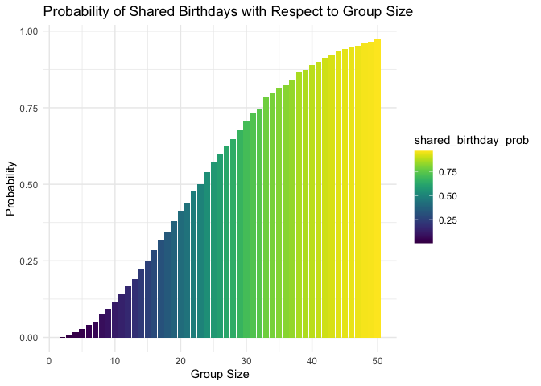

P8105 HW5
================
Veerapetch Petchger
2025-10-31

# Problem 1

**Suppose you put 𝑛 people in a room, and want to know the probability
that at least two people share a birthday. For simplicity, we’ll assume
there are no leap years (i.e. there are only 365 days) and that
birthdays are uniformly distributed over the year (which is actually not
the case).**

**Write a function that, for a fixed group size, randomly draws
“birthdays” for each person; checks whether there are duplicate
birthdays in the group; and returns TRUE or FALSE based on the result.**

``` r
shared_birthday = function(group_size) {
  
  birthdays = sample(1:365, group_size, replace = TRUE)
  length(birthdays) != length(unique(birthdays))
 
}
```

**Next, run this function 10000 times for each group size between 2 and
50. For each group size, compute the probability that at least two
people in the group will share a birthday by averaging across the 10000
simulation runs. Make a plot showing the probability as a function of
group size, and comment on your results.**

``` r
birthday_df =
  tibble(group_size = 2:50) %>% 
  mutate(shared_birthday_prob = map_dbl(
    group_size,
    ~ mean((replicate(10000, shared_birthday(.x)))
  )))

birthday_df %>% 
  ggplot(aes(x = group_size, y = shared_birthday_prob, fill = shared_birthday_prob)) +
  geom_col() + 
  labs(
    title = "Probability of Shared Birthdays with Respect to Group Size",
    x = "Group Size",
    y = "Probability"
  ) +
  viridis::scale_fill_viridis() +
  theme_minimal()
```

<!-- --> The
probability of a shared birthday has a positive exponential relationship
with group size. At a group size of 23, the probability of a shared
birthday is approximately 50%, and caps at 0.972.

# Problem 2

**When designing an experiment or analysis, a common question is whether
it is likely that a true effect will be detected – put differently,
whether a false null hypothesis will be rejected. The probability that a
false null hypothesis is rejected is referred to as power, and it
depends on several factors, including: the sample size; the effect size;
and the error variance. In this problem, you will conduct a simulation
to explore power in a one-sample t-test.**

**First set the following design elements**

- Fix 𝑛=30
- Fix 𝜎=5

**Generate 5000 datasets from the model**

𝑥∼𝑁𝑜𝑟𝑚𝑎𝑙\[𝜇,𝜎\]

**For each dataset, save 𝜇̂ and the p-value arising from a test of 𝐻:𝜇=0
using 𝛼=0.05. Hint: to obtain the estimate and p-value, use broom::tidy
to clean the output of t.test.**

**Repeat the above for 𝜇={1,2,3,4,5,6}, and complete the following:**

``` r
set.seed(1)
power_t = function(n = 30, sigma = 5, mu = 0, mu_hat = 0) {
  
  power_df = 
    tibble(
      x = rnorm(n, mu, sigma)
    )
  
  samp_mean = 
    power_df %>% 
    summarize(
      mu_hat = mean(x),
      p_val = t.test(x, mu = mu) %>%
        broom::tidy() %>% 
        pull(p.value)
    )
  
  return(samp_mean)
}

results_mu0 = 
  rerun(5000, power_t(n = 30, sigma = 5, mu = 0, mu_hat = 0 )) %>% 
  bind_rows()

mu_vals = 0:6

power_results = 
  tibble(true_mean = mu_vals) %>% 
  mutate(
    power_df = map(
      true_mean, ~rerun(5000, power_t(n = 30, sigma = 5, mu = .x, mu_hat = 0 )))) %>% 
  bind_rows() %>% 
  unnest(power_df)
```

- Make a plot showing the proportion of times the null was rejected (the
  power of the test) on the y axis and the true value of 𝜇on the x axis.
  Describe the association between effect size and power.

- Make a plot showing the average estimate of 𝜇̂ on the y axis and the
  true value of 𝜇 on the x axis. Make a second plot (or overlay on the
  first) the average estimate of 𝜇̂ only in samples for which the null
  was rejected on the y axis and the true value of on the x axis. Is the
  sample average of 𝜇̂ across tests for which the null is rejected
  approximately equal to the true value of 𝜇? Why or why not?
