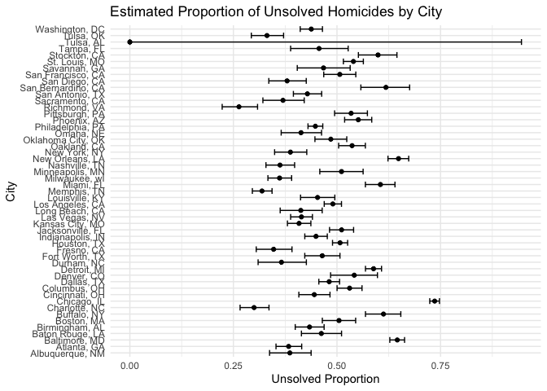

P8105 HW5
================
Veerapetch Petchger
2025-10-31

# Problem 1

**Suppose you put 𝑛 people in a room, and want to know the probability
that at least two people share a birthday. For simplicity, we’ll assume
there are no leap years (i.e. there are only 365 days) and that
birthdays are uniformly distributed over the year (which is actually not
the case).**

**Write a function that, for a fixed group size, randomly draws
“birthdays” for each person; checks whether there are duplicate
birthdays in the group; and returns TRUE or FALSE based on the result.**

``` r
shared_birthday = function(group_size) {
  
  birthdays = sample(1:365, group_size, replace = TRUE)
  length(birthdays) != length(unique(birthdays))
 
}
```

**Next, run this function 10000 times for each group size between 2 and
50. For each group size, compute the probability that at least two
people in the group will share a birthday by averaging across the 10000
simulation runs. Make a plot showing the probability as a function of
group size, and comment on your results.**

``` r
birthday_df =
  tibble(group_size = 2:50) %>% 
  mutate(shared_birthday_prob = map_dbl(
    group_size,
    ~ mean((replicate(10000, shared_birthday(.x)))
  )))

birthday_df %>% 
  ggplot(aes(x = group_size, y = shared_birthday_prob, fill = shared_birthday_prob)) +
  geom_col() + 
  labs(
    title = "Probability of Shared Birthdays with Respect to Group Size",
    x = "Group Size",
    y = "Probability"
  ) +
  viridis::scale_fill_viridis() +
  theme_minimal()
```

<!-- --> The
probability of a shared birthday has a positive exponential relationship
with group size. At a group size of 23, the probability of a shared
birthday is approximately 50%, and caps at 0.972.
